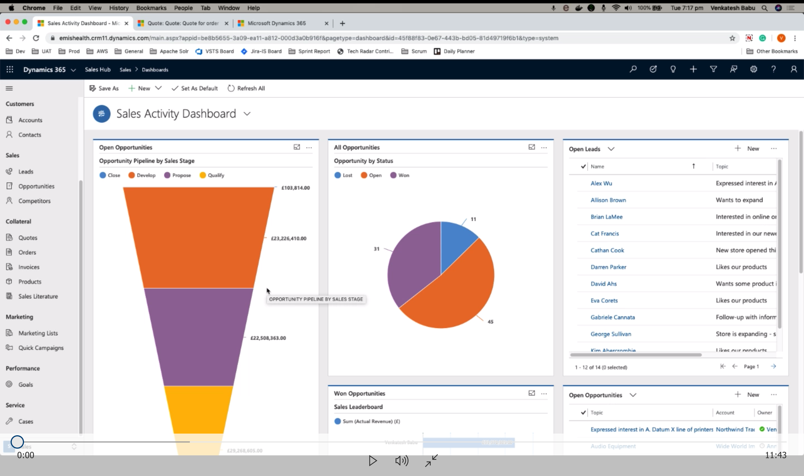

# Microsoft CRM

## Background

- Microsoft Dynamics CRM focuses mainly on sales, marketing, and service (help desk) sectors
- Microsoft CRM is a part of the Microsoft Dynamics family of business applications (D365)
- Microsoft has been marketing Dynamics CRM as a CRM platform and has been encouraging partners to use its once proprietary, now Open Source (.NET based) framework to customize it. 

## Versions

- Workgroup Edition
- Professional Edition
- Enterprise Edition
- Service Provider Edition

## CRM Features

- Customers
  - Accounts
  - Contacts
  
- Sales
  - Leads
  - Oppurtunities
  - Competitors
  
- Collateral
  - Quotes
  - Orders
  - Invoices
  - Products
  - Sales Literature

- Marketing
  - Marketing List
  - Campaign
  
- Performance
  - User Goals
  
- Service
  - Cases
  
## Demo Video

## Sources

- [Microsoft CRM Wiki](https://en.wikipedia.org/wiki/Microsoft_Dynamics_CRM)
- [Trial Dynamics](https://trials.dynamics.com/)
